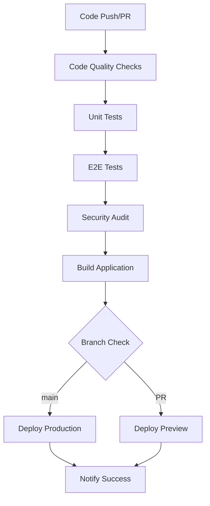

# CI/CD Documentation

This document describes the Continuous Integration and Continuous Deployment (CI/CD) setup for the Movie Recommendation App.

## Overview

The CI/CD pipeline is built using GitHub Actions and provides:

- Automated code quality checks
- Comprehensive testing (unit, integration, E2E)
- Security vulnerability scanning
- Automated deployments to Vercel
- Preview deployments for pull requests

## Workflow Architecture



## Workflows

### 1. Main CI/CD Pipeline (`ci-cd.yml`)

**Triggers:**
- Push to `main` or `develop` branches
- Pull requests to `main` branch

**Jobs:**
1. **quality-and-test**: Code quality and unit testing
2. **e2e-tests**: End-to-end testing with Playwright
3. **build**: Application build process
4. **security-audit**: Dependency vulnerability scanning
5. **deploy-production**: Production deployment (main branch only)
6. **deploy-preview**: Preview deployment (PRs only)
7. **notify**: Deployment notifications

### 2. Code Quality (`code-quality.yml`)

**Triggers:**
- Push to any branch
- Pull requests

**Features:**
- ESLint analysis with annotations
- Prettier formatting checks
- TypeScript type checking
- PR comments with quality reports

### 3. Manual Deploy (`manual-deploy.yml`)

**Triggers:**
- Manual workflow dispatch

**Features:**
- Deploy to staging or production
- Optional test skipping
- Custom deployment messages

## Environment Configuration

### Required Secrets

Configure these in GitHub repository settings:

| Secret | Description | Usage |
|--------|-------------|-------|
| `VITE_CLERK_PUBLISHABLE_KEY` | Clerk authentication public key | Authentication in builds |
| `VITE_TMDB_API_KEY` | The Movie Database API key | Movie data fetching |
| `VERCEL_TOKEN` | Vercel deployment token | Automated deployments |
| `VERCEL_ORG_ID` | Vercel organization ID | Deployment configuration |
| `VERCEL_PROJECT_ID` | Vercel project ID | Deployment target |

### Environment Variables

| Variable | Default | Description |
|----------|---------|-------------|
| `VITE_TMDB_BASE_URL` | `https://api.themoviedb.org/3` | TMDB API base URL |
| `VITE_TMDB_IMAGE_BASE_URL` | `https://image.tmdb.org/t/p` | TMDB image base URL |
| `VITE_APP_NAME` | `Movie Recommendation App` | Application name |
| `VITE_APP_VERSION` | `1.0.0` | Application version |

## Quality Gates

The pipeline enforces these quality gates:

### Code Quality
- ✅ ESLint rules must pass (no errors)
- ✅ Prettier formatting must be consistent
- ✅ TypeScript compilation must succeed
- ✅ No moderate or high severity vulnerabilities

### Testing
- ✅ All unit tests must pass
- ✅ Code coverage must meet thresholds
- ✅ E2E tests must pass
- ✅ Integration tests must pass

### Build
- ✅ Application must build successfully
- ✅ No build warnings or errors
- ✅ Bundle size within acceptable limits

## Deployment Strategy

### Production Deployment
- **Trigger**: Push to `main` branch
- **Environment**: Production Vercel environment
- **URL**: Production domain
- **Requirements**: All quality gates must pass

### Preview Deployment
- **Trigger**: Pull request to `main`
- **Environment**: Preview Vercel environment
- **URL**: Unique preview URL per PR
- **Requirements**: Build must succeed

### Manual Deployment
- **Trigger**: Manual workflow dispatch
- **Environment**: Configurable (staging/production)
- **Features**: Optional test skipping, custom messages

## Monitoring and Notifications

### Test Results
- Unit test results uploaded to artifacts
- Coverage reports sent to Codecov
- E2E test reports with screenshots

### Code Quality
- ESLint results annotated on PRs
- Quality reports posted as PR comments
- Failed checks block merging

### Deployments
- Deployment status in workflow summary
- Success/failure notifications
- Preview URLs posted to PRs

## Artifacts and Reports

### Generated Artifacts
- `test-results`: Unit test results and coverage
- `playwright-report`: E2E test results and screenshots
- `build-files`: Production build artifacts
- `eslint-report`: Code quality analysis

### Retention Policy
- Test artifacts: 7 days
- Build artifacts: 7 days
- Playwright reports: 7 days

## Troubleshooting

### Common Issues

#### 1. Test Failures
**Symptoms**: Tests fail in CI but pass locally
**Solutions**:
- Check environment variables
- Verify Node.js version consistency
- Review test logs in Actions tab

#### 2. Build Failures
**Symptoms**: Build fails during CI
**Solutions**:
- Check TypeScript errors
- Verify all dependencies are installed
- Review build logs for specific errors

#### 3. Deployment Failures
**Symptoms**: Deployment step fails
**Solutions**:
- Verify Vercel secrets are configured
- Check Vercel project settings
- Review deployment logs

#### 4. Security Audit Failures
**Symptoms**: Security audit job fails
**Solutions**:
- Run `npm audit` locally
- Update vulnerable dependencies
- Use `npm audit fix` for automatic fixes

### Debug Steps

1. **Check Workflow Logs**
   - Go to Actions tab in GitHub
   - Click on failed workflow
   - Review job logs for errors

2. **Local Reproduction**
   ```bash
   # Run the same checks locally
   npm run ci
   npm run test:e2e:all
   npm run audit:security
   ```

3. **Environment Verification**
   ```bash
   # Check environment variables
   echo $VITE_CLERK_PUBLISHABLE_KEY
   echo $VITE_TMDB_API_KEY
   ```

4. **Dependency Issues**
   ```bash
   # Clean install
   rm -rf node_modules package-lock.json
   npm install
   ```

## Performance Optimization

### Workflow Optimization
- Parallel job execution
- Dependency caching with `actions/cache`
- Artifact sharing between jobs
- Conditional job execution

### Build Optimization
- TypeScript incremental compilation
- Vite build optimizations
- Bundle size monitoring
- Asset optimization

## Security Considerations

### Secret Management
- Secrets stored in GitHub repository settings
- Environment-specific secret scoping
- Regular secret rotation

### Dependency Security
- Automated vulnerability scanning
- Dependabot for dependency updates
- Security audit in CI pipeline

### Access Control
- Branch protection rules
- Required status checks
- Review requirements for main branch

## Maintenance

### Regular Tasks
- Review and update workflow dependencies
- Monitor build performance
- Update Node.js version
- Review security audit results

### Dependency Updates
- Dependabot automatically creates PRs
- Review and test dependency updates
- Monitor for breaking changes

### Workflow Updates
- Keep GitHub Actions up to date
- Review and optimize workflow performance
- Add new quality checks as needed

## Best Practices

### Commit Messages
- Use conventional commit format
- Include scope and description
- Reference issue numbers

### Pull Requests
- Ensure all checks pass before requesting review
- Include description of changes
- Test locally before pushing

### Branch Management
- Use feature branches for development
- Keep main branch stable
- Regular cleanup of merged branches

### Testing
- Write tests for new features
- Maintain good test coverage
- Include E2E tests for critical paths